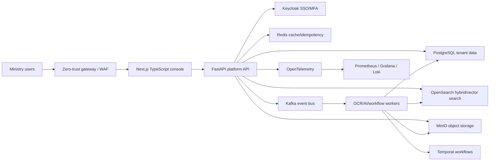
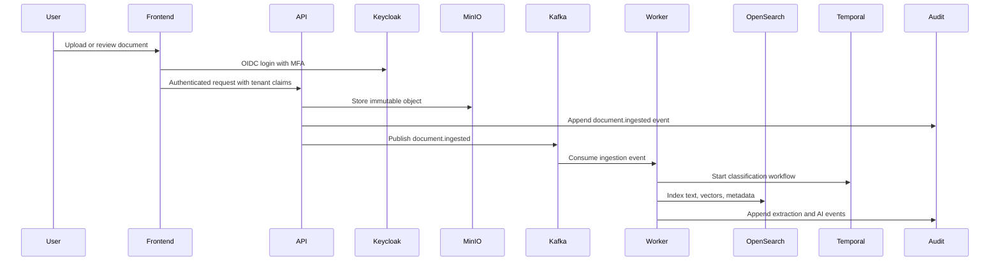
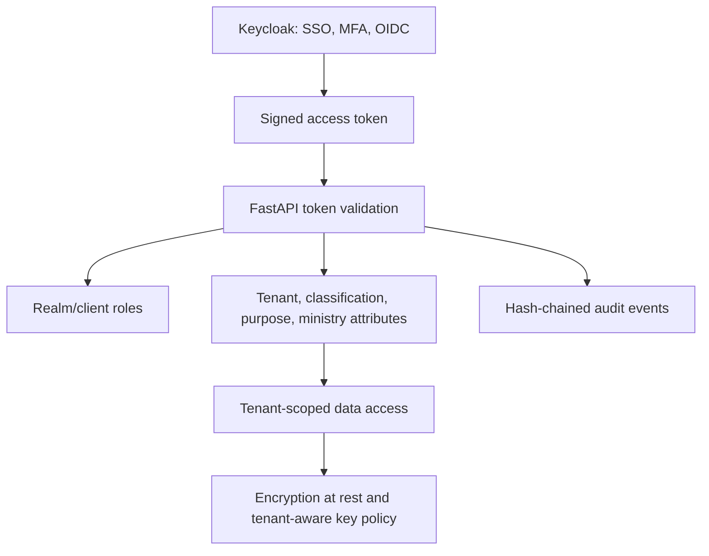
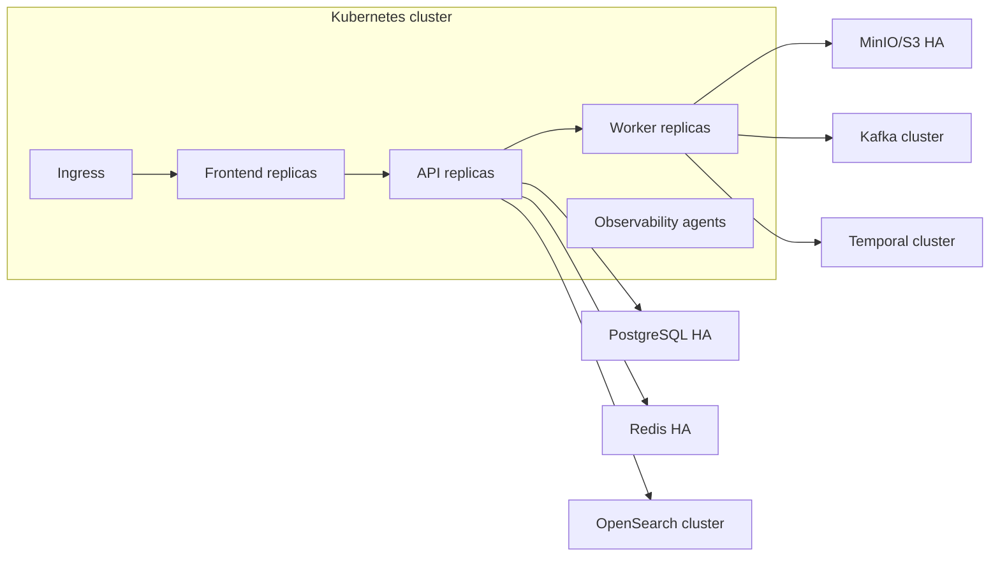
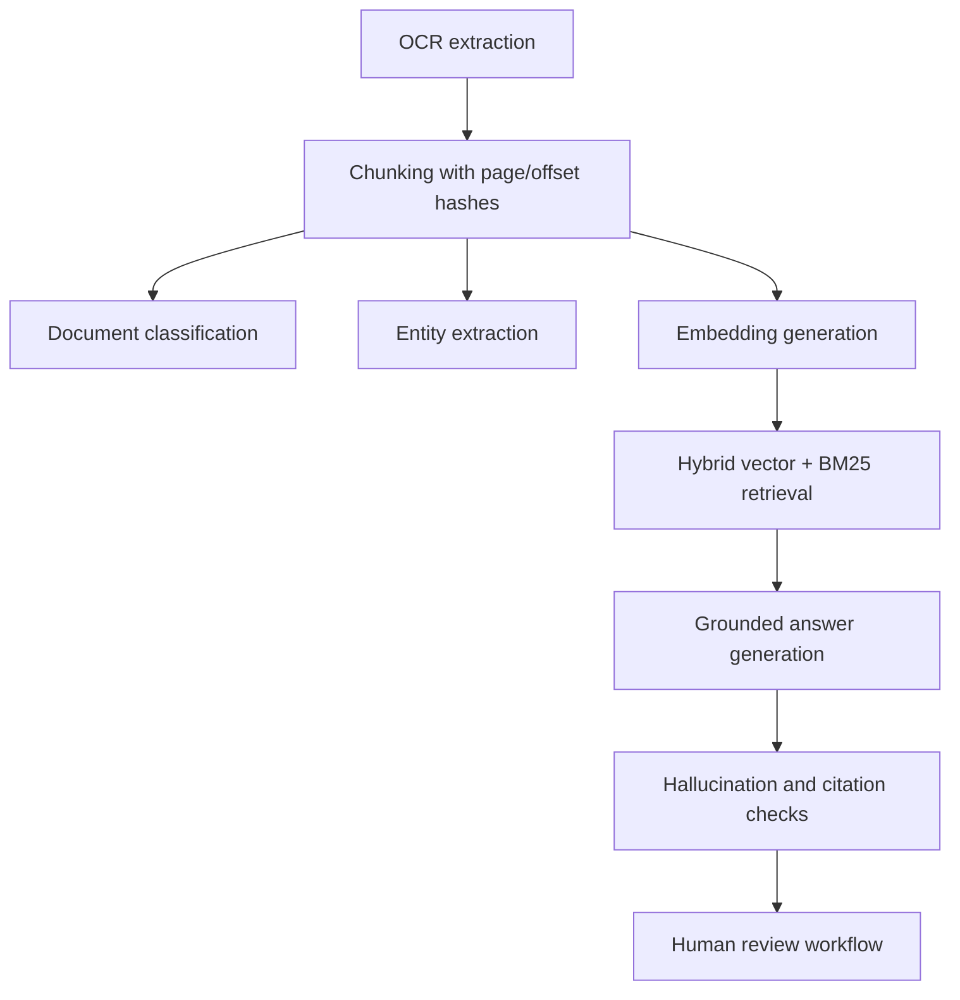

# Target Architecture

## Logical Architecture

## Data Flow

## Security Architecture

## Deployment Architecture

## AI Architecture

## Integration Architecture

- Keycloak provides SSO, MFA, role mapping, and tenant claims.
- Kafka carries document, audit, workflow, and notification events.
- Temporal coordinates ingestion, OCR, classification, review, SLA, and escalation workflows.
- PostgreSQL stores tenant metadata, cases, workflow state, audit event envelopes, and lineage.
- MinIO stores immutable binaries, OCR artifacts, model outputs, and evidence bundles.
- OpenSearch provides keyword, metadata, and vector retrieval.
- Prometheus, Grafana, Loki, and OpenTelemetry provide metrics, dashboards, logs, and traces.

